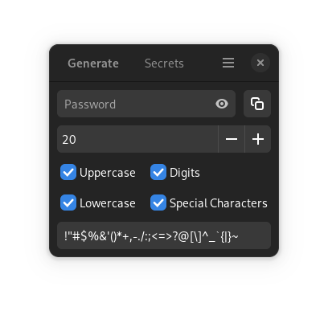

# Secrets

A small app written in Python, Gtk4 and Libadwaita that can generate passwords.
Users are able to choose what characters they want to use.
The algorythm probably needs some improvement.
The app is **NOT** intended to replace your passwordmanager but as a backup solution if the integrated passwordgenerator in IE Firefox doesn't recognise the password field or you need to generate a password for an app where yyou can't use your passwordmanager.

Some important links: 
* View the sourcecode on [Github](https://github.com/UnicornyRainbow/Secrets) or [GitLab](https://gitlab.com/UnicornyRainbow/Secrets)
* Or [install](https://UnicornyRainbow.github.io/Secrets/install) Secrets.
* Take a look at my other [projects](https://UnicornyRainbow.github.io/UnicornyRainbow/myProjects)
